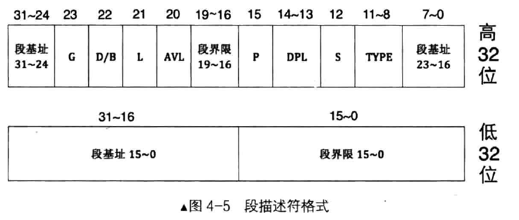
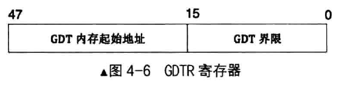
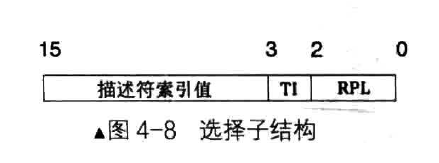

# 32 位保护模式

## 保护模式介绍
> CPU 保护模式是一种让计算机更安全、更稳定的运行方式。在这种模式下，CPU 对内存的访问受到限制，就像一个安全防护网，防止恶意程序破坏你的电脑。操作系统在这个模式下负责管理内存和设备驱动程序，让程序和数据在正确的地方，以正确的方式被访问。

## 进入保护模式的步骤
> 1. 打开 A20 线
>
> 2. 加载 gdt 全局描述符表
>
> 3. 将 cr0 寄存器第一位置1
>
>        ; 打开 A20 线
>        in al,  0x92
>        or al, 0b10
>        out 0x92, al
>    
>        lgdt [gdt_ptr]; 加载 gdt
>    
>        ; 启动保护模式
>        mov eax, cr0
>        or eax, 1
>        mov cr0, eax
---

# 全局描述符表
## 全局描述符
> - 用8个字节表示当前内存的信息
>
> 
> 
> 1. **段界限**表示当前段边界最值
>
> 2. **段基址**表示当前地址
>
> 3. **TYPE**表示段类型
>
> 4. **S**表示TYPE是代码段还是系统段，1是代码段或数据段，0是系统段
>
> 5. **DPL**表示描述特权级 0~3 ，数字越小，权限越高
>
> 6. **P**表示段是否存在，P为1表示在内存中，0则不在
>
> 7. **AVL**没用
>
> 8. **L**表示是否扩展64位，1则扩展，0则不扩展
>
> 9. **D/B**用来指示有效地址（段内偏移地址）及操作数的大小
>
>    - 对于代码段来说，此位是D位，若D为0，表示指令中的有效地址和操作数是16位，指令有效地址用IP寄存器。若D为1，表示指令中的有效地址及操作数32 位，指令有效地址用EIP寄存器
>
>    - 对于栈段来说，此位是B位，用来指定操作数大小，此操作数涉及到栈指针寄存器的选择及栈的地址上限。若B为0，使用的是SP寄存器，也就是拢的起始地址是16 位寄存器的最大寻址范围， 0xFFFF。若B为1，使用的是ESP寄存器，也就是栈的起始地址是32位寄存器的最大寻址范围，0xFFFFFFFF
>
> 10. **G**表示指定段界限单位大小，1是4KB，0是1B
>
>            ; 内存界限 4G / 4K - 1, 1M
>            memory_limit equ ((1024 * 1024 * 1024 * 4) / (1024 * 4)) - 1
>
>            gdt_ptr:
>                dw (gdt_end - gdt_base) - 1
>                dd gdt_base
>            gdt_base:
>                dd 0, 0; NULL 描述符
>            gdt_code:
>                dw memory_limit & 0xffff; 段界限 0 ~ 15 位
>                dw memory_base & 0xffff; 基地址 0 ~ 15 位
>                db (memory_base >> 16) & 0xff; 基地址 16 ~ 23 位
>                ; 存在 - dlp 0 - S _ 代码 - 非依从 - 可读 - 没有被访问过
>                db 0b_1_00_1_1_0_1_0;
>                ; 4k - 32 位 - 不是 64 位 - 段界限 16 ~ 19
>                db 0b1_1_0_0_0000 | (memory_limit >> 16) & 0xf;
>                db (memory_base >> 24) & 0xff; 基地址 24 ~ 31 位
>            gdt_data:
>                dw memory_limit & 0xffff; 段界限 0 ~ 15 位
>                dw memory_base & 0xffff; 基地址 0 ~ 15 位
>                db (memory_base >> 16) & 0xff; 基地址 16 ~ 23 位
>                ; 存在 - dlp 0 - S _ 数据 - 向上 - 可写 - 没有被访问过
>                db 0b_1_00_1_0_0_1_0;
>                ; 4k - 32 位 - 不是 64 位 - 段界限 16 ~ 19
>                db 0b1_1_0_0_0000 | (memory_limit >> 16) & 0xf;
>                db (memory_base >> 24) & 0xff; 基地址 24 ~ 31 位
>            gdt_end:
>         

## 全局描述符表 GDT
> - 全局描述符存放在 GDT 中，GDT相当于一个描述符数组
>
> - GDTR寄存器专门存放GDT的位置信息
>
> 
>
> - 0~15bit 表示GDT有多少个描述符，16~47bit 表示GDT内存起始地址

## 段选择子
>
>
> - **RPL**为当前权限等级
>
> - **TI**表示当前表是GDT还是LDT
>
> - 剩下的3~15bit为描述符表索引值

**例如选择子是0x8，将其加载到ds寄存器后，访问ds: 0x9 这样的内存，其过程是z 0x8 的低2 位是RPL，其值为00 。第2 是TI ，其值0，表示是在GDT中索引段描述符。用0x8 的高13 位0xl 在GDT 中索引，也就是GDT 中的第1 个段描述符（ GDT 中第0 个段描述符不可用）。假设第1 个段描述符中的3个段基址部分，其值为0xl234。CPU 将0xl234 作为段基址，与段内偏移地址0x9 相加， 0x1234+0x9=0x123d。所得的和Oxl23d 作为访存地址。**

   