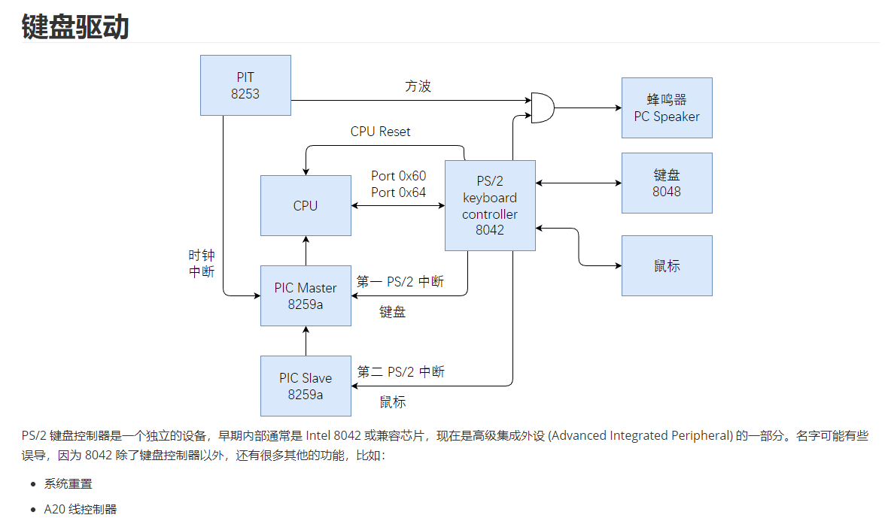
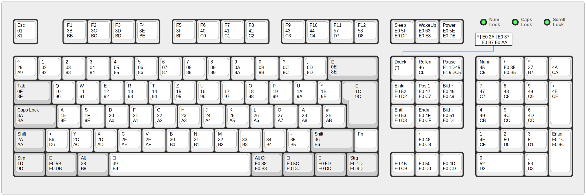

# 键盘驱动
## 键盘硬件结构

CPU 通过 0x60 和 0x64 端口来获取键盘传来的数据

当 CPU 接收到键盘的中断信号后，会在中断处理函数中处理 0x60 和 0x64 端口传来的数据，经过数组转换成需要显示的字符，显示到屏幕上

## 键盘扫描码

键盘扫描码分为：

- 通码：按下按键产生的扫描码(上面的数字)

- 断码：抬起按键产生的扫描码(下面的数字)

## 代码
    static char keymap[][4] = {
        /* 扫描码 未与 shift 组合  与 shift 组合 以及相关状态 */
        /* ---------------------------------- */
        /* 0x00 */ {INV, INV, false, false},   // NULL
        /* 0x01 */ {0x1b, 0x1b, false, false}, // ESC
        /* 0x02 */ {'1', '!', false, false},
        /* 0x03 */ {'2', '@', false, false},
        /* 0x04 */ {'3', '#', false, false},
        /* 0x05 */ {'4', '$', false, false},
        /* 0x06 */ {'5', '%', false, false},
        /* 0x07 */ {'6', '^', false, false},
        /* 0x08 */ {'7', '&', false, false},
        /* 0x09 */ {'8', '*', false, false},
        /* 0x0A */ {'9', '(', false, false},
        /* 0x0B */ {'0', ')', false, false},
        /* 0x0C */ {'-', '_', false, false},
        /* 0x0D */ {'=', '+', false, false},
        /* 0x0E */ {'\b', '\b', false, false}, // BACKSPACE
        /* 0x0F */ {'\t', '\t', false, false}, // TAB
        /* 0x10 */ {'q', 'Q', false, false},
        /* 0x11 */ {'w', 'W', false, false},
        /* 0x12 */ {'e', 'E', false, false},
        /* 0x13 */ {'r', 'R', false, false},
        /* 0x14 */ {'t', 'T', false, false},
        /* 0x15 */ {'y', 'Y', false, false},
        /* 0x16 */ {'u', 'U', false, false},
        /* 0x17 */ {'i', 'I', false, false},
        /* 0x18 */ {'o', 'O', false, false},
        /* 0x19 */ {'p', 'P', false, false},
        /* 0x1A */ {'[', '{', false, false},
        /* 0x1B */ {']', '}', false, false},
        /* 0x1C */ {'\n', '\n', false, false}, // ENTER
        /* 0x1D */ {INV, INV, false, false},   // CTRL_L
        /* 0x1E */ {'a', 'A', false, false},
        /* 0x1F */ {'s', 'S', false, false},
        /* 0x20 */ {'d', 'D', false, false},
        /* 0x21 */ {'f', 'F', false, false},
        /* 0x22 */ {'g', 'G', false, false},
        /* 0x23 */ {'h', 'H', false, false},
        /* 0x24 */ {'j', 'J', false, false},
        /* 0x25 */ {'k', 'K', false, false},
        /* 0x26 */ {'l', 'L', false, false},
        /* 0x27 */ {';', ':', false, false},
        /* 0x28 */ {'\'', '"', false, false},
        /* 0x29 */ {'`', '~', false, false},
        /* 0x2A */ {INV, INV, false, false}, // SHIFT_L
        /* 0x2B */ {'\\', '|', false, false},
        /* 0x2C */ {'z', 'Z', false, false},
        /* 0x2D */ {'x', 'X', false, false},
        /* 0x2E */ {'c', 'C', false, false},
        /* 0x2F */ {'v', 'V', false, false},
        /* 0x30 */ {'b', 'B', false, false},
        /* 0x31 */ {'n', 'N', false, false},
        /* 0x32 */ {'m', 'M', false, false},
        /* 0x33 */ {',', '<', false, false},
        /* 0x34 */ {'.', '>', false, false},
        /* 0x35 */ {'/', '?', false, false},
        /* 0x36 */ {INV, INV, false, false},  // SHIFT_R
        /* 0x37 */ {'*', '*', false, false},  // PAD *
        /* 0x38 */ {INV, INV, false, false},  // ALT_L
        /* 0x39 */ {' ', ' ', false, false},  // SPACE
        /* 0x3A */ {INV, INV, false, false},  // CAPSLOCK
        /* 0x3B */ {INV, INV, false, false},  // F1
        /* 0x3C */ {INV, INV, false, false},  // F2
        /* 0x3D */ {INV, INV, false, false},  // F3
        /* 0x3E */ {INV, INV, false, false},  // F4
        /* 0x3F */ {INV, INV, false, false},  // F5
        /* 0x40 */ {INV, INV, false, false},  // F6
        /* 0x41 */ {INV, INV, false, false},  // F7
        /* 0x42 */ {INV, INV, false, false},  // F8
        /* 0x43 */ {INV, INV, false, false},  // F9
        /* 0x44 */ {INV, INV, false, false},  // F10
        /* 0x45 */ {INV, INV, false, false},  // NUMLOCK
        /* 0x46 */ {INV, INV, false, false},  // SCRLOCK
        /* 0x47 */ {'7', INV, false, false},  // pad 7 - Home
        /* 0x48 */ {'8', INV, false, false},  // pad 8 - Up
        /* 0x49 */ {'9', INV, false, false},  // pad 9 - PageUp
        /* 0x4A */ {'-', '-', false, false},  // pad -
        /* 0x4B */ {'4', INV, false, false},  // pad 4 - Left
        /* 0x4C */ {'5', INV, false, false},  // pad 5
        /* 0x4D */ {'6', INV, false, false},  // pad 6 - Right
        /* 0x4E */ {'+', '+', false, false},  // pad +
        /* 0x4F */ {'1', INV, false, false},  // pad 1 - End
        /* 0x50 */ {'2', INV, false, false},  // pad 2 - Down
        /* 0x51 */ {'3', INV, false, false},  // pad 3 - PageDown
        /* 0x52 */ {'0', INV, false, false},  // pad 0 - Insert
        /* 0x53 */ {'.', 0x7F, false, false}, // pad . - Delete
        /* 0x54 */ {INV, INV, false, false},  //
        /* 0x55 */ {INV, INV, false, false},  //
        /* 0x56 */ {INV, INV, false, false},  //
        /* 0x57 */ {INV, INV, false, false},  // F11
        /* 0x58 */ {INV, INV, false, false},  // F12
        /* 0x59 */ {INV, INV, false, false},  //
        /* 0x5A */ {INV, INV, false, false},  //
        /* 0x5B */ {INV, INV, false, false},  // Left Windows
        /* 0x5C */ {INV, INV, false, false},  // Right Windows
        /* 0x5D */ {INV, INV, false, false},  // Clipboard
        /* 0x5E */ {INV, INV, false, false},  //

        // Print Screen 是强制定义 本身是 0xB7
        /* 0x5F */ {INV, INV, false, false}, // PrintScreen
    };

此数组用来表示键盘信息，第一false表示普通码是否按下，第二个false表示扩展码是否按下

    void keyboard_handler(int vector)
    {
        assert(vector == 0x21);
        send_eoi(vector); // 向中断控制器发送中断处理结束的信息

        // 接收扫描码
        u16 scancode = inb(KEYBOARD_DATA_PORT);
        u8 ext = 2; // keymap 状态索引，默认没有 shift 键

        // 获得通码
        u16 makecode = (scancode & 0x7f);
        if (makecode == CODE_PRINT_SCREEN_DOWN)
        {
            makecode = KEY_PRINT_SCREEN;
        }

        // 通码非法
        if (makecode > KEY_PRINT_SCREEN)
        {
            return;
        }

        // DEBUGK("scancode 0x%x\n", scancode);

        // 是否是断码，按键抬起
        bool breakcode = ((scancode & 0x0080) != 0);
        if (breakcode)
        {
            // 如果是则设置状态
            keymap[makecode][ext] = false;
            return;
        }

        // 下面是通码，按键按下
        keymap[makecode][ext] = true;

        // 计算 shift 状态
        bool shift = false;
        if (capslock_state && ('a' <= keymap[makecode][0] && keymap[makecode][0] <= 'z'))
        {
            shift = !shift;
        }
        if (shift_state)
        {
            shift = !shift;
        }

        // 获得按键 ASCII 码
        char ch = 0;
        // [/?] 这个键比较特殊，只有这个键扩展码和普通码一样
        if (ext == 3 && (makecode != KEY_SLASH))
        {
            ch = keymap[makecode][1];
        }
        else
        {
            ch = keymap[makecode][shift];
        }

        if (ch == INV)
            return;

        // LOGK("keydown %c \n", ch);
        fifo_put(&fifo, ch);
        if (waiter != NULL)
        {
            task_unblock(waiter);
            waiter = NULL;
        }
    }

1. 首先获得通码，转换成数组中对应的字符

2. 判断大写锁是否开启