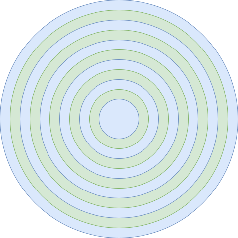

# 电梯算法
由于磁盘性能的主要瓶颈在磁盘的寻道时间，也就是磁头臂的移动时间，所以要尽可能避免磁头臂的移动。电梯算法的作用是让磁头的综合移动距离最小，从而改善磁盘访问时间。

    // 获得下一个请求
    static request_t *request_nextreq(device_t *device, request_t *req)
    {
        list_t *list = &device->request_list;

        if (device->direct == DIRECT_UP && req->node.next == &list->tail)
        {
            device->direct = DIRECT_DOWN;
        }
        else if (device->direct == DIRECT_DOWN && req->node.prev == &list->head)
        {
            device->direct = DIRECT_UP;
        }

        void *next = NULL;
        if (device->direct == DIRECT_UP)
        {
            next = req->node.next;
        }
        else
        {
            next = req->node.prev;
        }

        if (next == &list->head || next == &list->tail)
        {
            return NULL;
        }

        return element_entry(request_t, node, next);
    }

首先判断当前磁道是否在底部或者顶部，是的话改变方向。如果当前方向向上，则取链表当前节点中的下一个节点，反之取前一个节点