# 线程/进程PCB
## 线程控制块

    typedef struct task_t
    {
        u32 *stack;               // 内核栈
        list_node_t node;         // 任务阻塞节点
        task_state_t state;       // 任务状态
        u32 priority;             // 任务优先级
        u32 ticks;                // 剩余时间片
        u32 jiffies;              // 上次执行时全局时间片
        char name[TASK_NAME_LEN]; // 任务名
        u32 uid;                  // 用户 id
        u32 pde;                  // 页目录物理地址
        struct bitmap_t *vmap;    // 进程虚拟内存位图
        u32 magic;                // 内核魔数，用于检测栈溢出
    } task_t;

## 线程状态
    typedef enum task_state_t
    {
        TASK_INIT,     // 初始化
        TASK_RUNNING,  // 执行
        TASK_READY,    // 就绪
        TASK_BLOCKED,  // 阻塞
        TASK_SLEEPING, // 睡眠
        TASK_WAITING,  // 等待
        TASK_DIED,     // 死亡
    } task_state_t;

## 代码
    static task_t *task_create(target_t target, const char *name, u32 priority, u32 uid)
    {
        task_t *task = get_free_task(); // 获取一页内存
        memset(task, 0, PAGE_SIZE);

        u32 stack = (u32)task + PAGE_SIZE;

        stack -= sizeof(task_frame_t);
        task_frame_t *frame = (task_frame_t *)stack;
        frame->ebx = 0x11111111;
        frame->esi = 0x22222222;
        frame->edi = 0x33333333;
        frame->ebp = 0x44444444;
        frame->eip = (void *)target;

        strcpy((char *)task->name, name);

        task->stack = (u32 *)stack;
        task->priority = priority;
        task->ticks = task->priority;
        task->jiffies = 0;
        task->state = TASK_READY;
        task->uid = uid;
        task->vmap = &kernel_map;
        task->pde = KERNEL_PAGE_DIR; // page directory entry
        task->magic = ONIX_MAGIC;

        return task;
    }