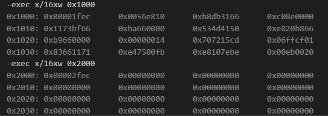
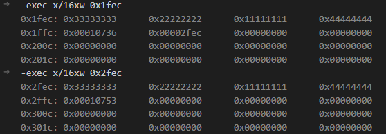
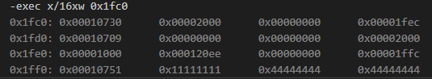

# 创建任务
    void schedule()
    {
        task_t *current = running_task();
        task_t *next = current == a ? b : a;
        task_switch(next);
    }
    
    u32 thread_a()
    {
        while (true)
        {
            printk("A");
            schedule();
        }
    }
    
    static void task_create(task_t *task, target_t target)
    {
        u32 stack = (u32)task + PAGE_SIZE;
    
        stack -= sizeof(task_frame_t);
        task_frame_t *frame = (task_frame_t *)stack;
        frame->ebx = 0x11111111;
        frame->esi = 0x22222222;
        frame->edi = 0x33333333;
        frame->ebp = 0x44444444;
        frame->eip = (void *)target;
    
        task->stack = (u32 *)stack;
    }
    
    void task_init()
    {
        task_create(a, thread_a);
        task_create(b, thread_b);
        schedule();
    }    

1. **task是起始任务地址，stack是当前任务栈底**

2. **task_frame_t结构体的eip元素存储当前任务执行函数地址**

3. **task->stack的值为当前task任务栈底**

- 0x1fec 和 0x2fec 是frame结构体的测试元素

# 切换任务
    void schedule()
    {
        task_t *current = running_task();
        task_t *next = current == a ? b : a;
        task_switch(next);
    }
- 获取当前正在运行的任务的地址

- 将next参数压栈

  
**此时任务处于A函数**

    global task_switch
    task_switch:
        push ebp
        mov ebp, esp
    
        push ebx
        push esi
        push edi
    
        mov eax, esp;
        and eax, 0xfffff000; current
    
        mov [eax], esp; 保存栈顶指针到0x1000物理位置
    
        mov eax, [ebp + 8]; next
        mov esp, [eax]
    
        pop edi
        pop esi
        pop ebx
        pop ebp
    
        ret

- push ebp 保存当前栈底的值

- 之后保存当前任务环境测试值

- 将esp寄存器的值保存到eax寄存器中，将当前的栈顶值保存到eax内存单元

- 将next参数任务地址传入eax寄存器，将当前A任务环境改成B任务环境，ret指令后，跳转执行eip寄存器的值

# 任务调度策略
    // 从任务数组中查找某种状态的任务，自己除外
    static task_t *task_search(task_state_t state)
    {
        assert(!get_interrupt_state());
        task_t *task = NULL;
        task_t *current = running_task();

        for (size_t i = 0; i < NR_TASKS; i++)
        {
            task_t *ptr = task_table[i];
            if (ptr == NULL)
                continue;

            if (ptr->state != state)
                continue;
            if (current == ptr)
                continue;
            if (task == NULL || task->ticks < ptr->ticks || ptr->jiffies < task->jiffies)
                task = ptr;
        }
        return task;
    }

1. 判断下一个任务是否为空

2. 状态是否等于就绪，不能为原来的任务

3. 当前任务剩余时间小于下一个任务剩余时间，则调度

4. 当前任务时间片大于下一个任务时间片，则调度