# 任务状态段
## 任务特权环

## TSS状态段
    typedef struct tss_t
    {
        u32 backlink; // 前一个任务的链接，保存了前一个任状态段的段选择子
        u32 esp0;     // ring0 的栈顶地址
        u32 ss0;      // ring0 的栈段选择子
        u32 esp1;     // ring1 的栈顶地址
        u32 ss1;      // ring1 的栈段选择子
        u32 esp2;     // ring2 的栈顶地址
        u32 ss2;      // ring2 的栈段选择子
        u32 cr3;
        u32 eip;
        u32 flags;
        u32 eax;
        u32 ecx;
        u32 edx;
        u32 ebx;
        u32 esp;
        u32 ebp;
        u32 esi;
        u32 edi;
        u32 es;
        u32 cs;
        u32 ss;
        u32 ds;
        u32 fs;
        u32 gs;
        u32 ldtr;          // 局部描述符选择子
        u16 trace : 1;     // 如果置位，任务切换时将引发一个调试异常
        u16 reversed : 15; // 保留不用
        u16 iobase;        // I/O 位图基地址，16 位从 TSS 到 IO 权限位图的偏移
        u32 ssp;           // 任务影子栈指针
    } _packed tss_t;

- 任务状态段 (TSS Task State Segment) 是 IA32 中一种二进制数据结构，保存了某个任务的信息，保护模式中 TSS 主要用于硬件任务切换，这种情况下，每个任务有自己独立的 TSS，对于软件的任务切换，也通常会有一两个任务状态段，使得任务从在中断时，能从 用户态(Ring3) 转到 内核态(Ring0)

## 状态段描述符

任务状态段描述符，描述了当前正在执行的任务，B 表示busy 位， B 位为 0 时，表示任务不繁忙， B 位为 1 时，表示任务繁忙。

CPU 提供了 TR(Task Register) 寄存器来存储该描述符，加载描述符到 TR 寄存器中的指令是：

    ltr

我们使用 TSS 的主要作用是利用其中的 `ss0` 和 `esp0`，使得用户态的程序可以转到内核态。

## 中断门处理过程
如果处理程序运行在低特权级，那么栈切换就会发生：

- 内核特权级的 栈段选择子 和 栈顶指针 将会从当前的 TSS 段中获得，在内核栈中将会压入用户态的 栈段选择子 和 栈顶指针；

- 保存当前的状态 eflags, cs, eip 到内核栈

- 如果存在错误码的话，压入错误码

## 进入用户态模式

    // 调用该函数的地方不能有任何局部变量
    // 调用前栈顶需要准备足够的空间
    void task_to_user_mode(target_t target)
    {
        task_t *task = running_task();

        // 创建用户进程虚拟内存位图
        task->vmap = kmalloc(sizeof(bitmap_t));
        void *buf = (void *)alloc_kpage(1);
        bitmap_init(task->vmap, buf, PAGE_SIZE, KERNEL_MEMORY_SIZE / PAGE_SIZE);

        // 创建用户进程页表
        task->pde = (u32)copy_pde();
        set_cr3(task->pde);

        u32 addr = (u32)task + PAGE_SIZE;

        addr -= sizeof(intr_frame_t);
        intr_frame_t *iframe = (intr_frame_t *)(addr);

        iframe->vector = 0x20;
        iframe->edi = 1;
        iframe->esi = 2;
        iframe->ebp = 3;
        iframe->esp_dummy = 4;
        iframe->ebx = 5;
        iframe->edx = 6;
        iframe->ecx = 7;
        iframe->eax = 8;

        iframe->gs = 0;
        iframe->ds = USER_DATA_SELECTOR;
        iframe->es = USER_DATA_SELECTOR;
        iframe->fs = USER_DATA_SELECTOR;
        iframe->ss = USER_DATA_SELECTOR;
        iframe->cs = USER_CODE_SELECTOR;

        iframe->error = ONIX_MAGIC;

        iframe->eip = (u32)target;
        iframe->eflags = (0 << 12 | 0b10 | 1 << 9);
        iframe->esp = USER_STACK_TOP;

        asm volatile(
            "movl %0, %%esp\n"
            "jmp interrupt_exit\n" ::"m"(iframe));
    }
