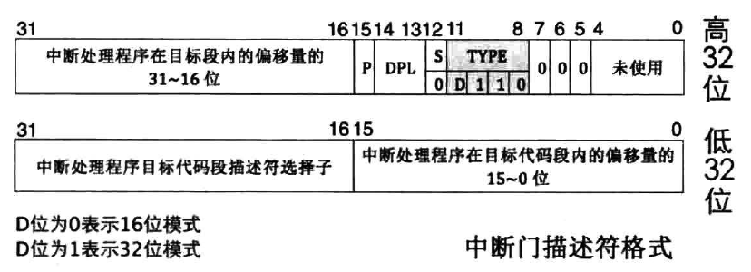

# 中断
## 中断介绍
- CPU 获知了计算机中发生的某些事， CPU 暂停正在执行的程序，转而去执行处理该事件的程序，当这段程序执行完毕后， CPU 继续执行刚才的程序。整个过程称为中断处理，也称为中断

- 中断机制可以让操作系统在执行某个程序的过程中，暂时将执行权交给其他程序，以实现多个程序的同时执行。发生中断时，操作系统会接管计算机的控制权，进行相应的管理工作，如进程切换、分配 I/O 设备等

# 中断分类
- 外中断

  - 时钟中断

  - 键盘中断

  - 硬盘中断

- 内中断

  - 软中断

    - 系统调用：读写文件

  - 异常

    - 除零

    - 指令错误

    - 缺页错误

# 中断描述符表 IDT
## 中断描述符

    typedef struct gate_t
    {
        u16 offset0;    // 段内偏移 0 ~ 15 位
        u16 selector;   // 代码段选择子
        u8 reserved;    // 保留不用
        u8 type : 4;    // 任务门/中断门/陷阱门
        u8 segment : 1; // segment = 0 表示系统段
        u8 DPL : 2;     // 使用 int 指令访问的最低权限
        u8 present : 1; // 是否有效
        u16 offset1;    // 段内偏移 16 ~ 31 位
    } _packed gate_t;

**与全局描述符表一样，中断描述符存放在IDTR寄存器中**

    typedef struct pointer
    {
        unsigned short limit; // size - 1
        unsigned int base;
    } __attribute__((packed)) pointer;

**INT指令触发中断，根据中断号找到对应的中断描述符，执行中断处理函数**

**初始化中断描述符代码**

    void interrupt_init()
    {
        for (size_t i = 0; i < ENTRY_SIZE; i++)
        {
            gate_t *gate = &idt[i];
            handler_t handler = handler_entry_table[i];

            gate->offset0 = (u32)handler & 0xffff;
            gate->offset1 = ((u32)handler >> 16) & 0xffff;
            gate->selector = 1 << 3; // 代码段
            gate->reserved = 0;      // 保留不用
            gate->type = 0b1110;     // 中断门
            gate->segment = 0;       // 系统段
            gate->DPL = 0;           // 内核态
            gate->present = 1;       // 有效
        }

        for (size_t i = 0; i < 0x20; i++)
        {
            handler_table[i] = exception_handler;
        }

        idt_ptr.base = (u32)idt;
        idt_ptr.limit = sizeof(idt) - 1;

        asm volatile("lidt idt_ptr\n");
    }