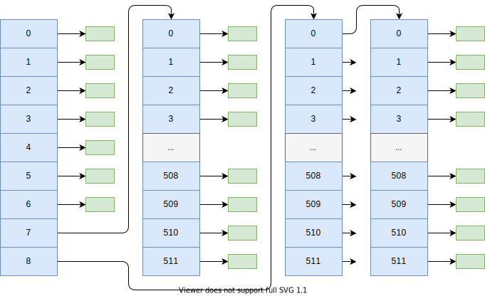

# 文件系统
## 块

前面是inode，后面是块存放数据

## inode
    typedef struct inode_desc_t
    {
        u16 mode;    // 文件类型和属性(rwx 位)
        u16 uid;     // 用户id（文件拥有者标识符）
        u32 size;    // 文件大小（字节数）
        u32 mtime;   // 修改时间戳 这个时间戳应该用 UTC 时间，不然有瑕疵
        u8 gid;      // 组id(文件拥有者所在的组)
        u8 nlinks;   // 链接数（多少个文件目录项指向该i 节点）
        u16 zone[9]; // 直接 (0-6)、间接(7)或双重间接 (8) 逻辑块号
    } inode_desc_t;

## 超级块

    typedef struct super_desc_t
    {
        u16 inodes;        // 节点数
        u16 zones;         // 逻辑块数
        u16 imap_blocks;   // i 节点位图所占用的数据块数
        u16 zmap_blocks;   // 逻辑块位图所占用的数据块数
        u16 firstdatazone; // 第一个数据逻辑块号
        u16 log_zone_size; // log2(每逻辑块数据块数)
        u32 max_size;      // 文件最大长度
        u16 magic;         // 文件系统魔数
    } super_desc_t;
    

## 目录
如果inode文件是目录，那么块存放的是以下数据

    // 文件目录项结构
    typedef struct dentry_t
    {
        u16 nr;        // i 节点
        char name[14]; // 文件名
    } dentry_t;